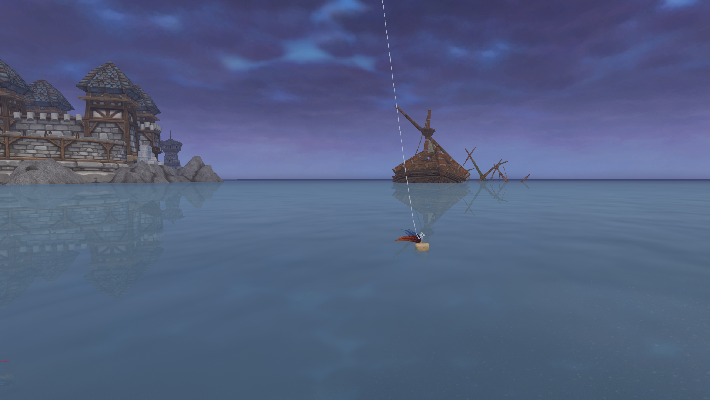

# WoW_fish_YOLO

WoW_fish_YOLO is a bot for World of Warcraft utilizing a pre-trained YOLO model. This project is developed in Python
with Ultralytics and has been trained on a dataset of 2800 screenshots from different regions of the game in the
Cataclysm version.

## Requirements

- Python 3.12 or higher
- A good CPU (or a GPU with CUDA if you want to update the code to use CUDA)

## Setup

1. Clone the repository:

```
$ git clone
```

2. Install the required packages:
```
$ pip install -r requirements.txt
```

## Configuration

1. Ensure World of Warcraft is open and the window is named "World of Warcraft". The bot will focus on this window.
2. The bot has been trained in first-person view. For optimal results:
    - Switch to first-person view.
    - Hide the user interface (use ALT + Z or ALT + W depending on your game configuration).

The setup should look like this:



## Usage

To run the bot, execute:

```
$ python bot.py
```

## Improvements

- Training: The bot reliably finds the fish 99% of the time in my setup, but there is room for improvement. For example, additional training with screenshots from different regions could enhance accuracy.
- Code Quality: While the primary focus was on functionality, the code itself could benefit from further optimization and refinement.